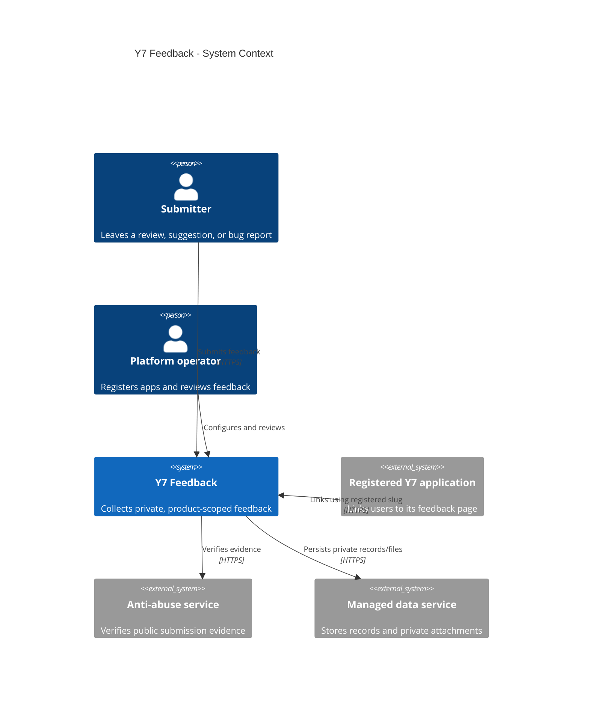
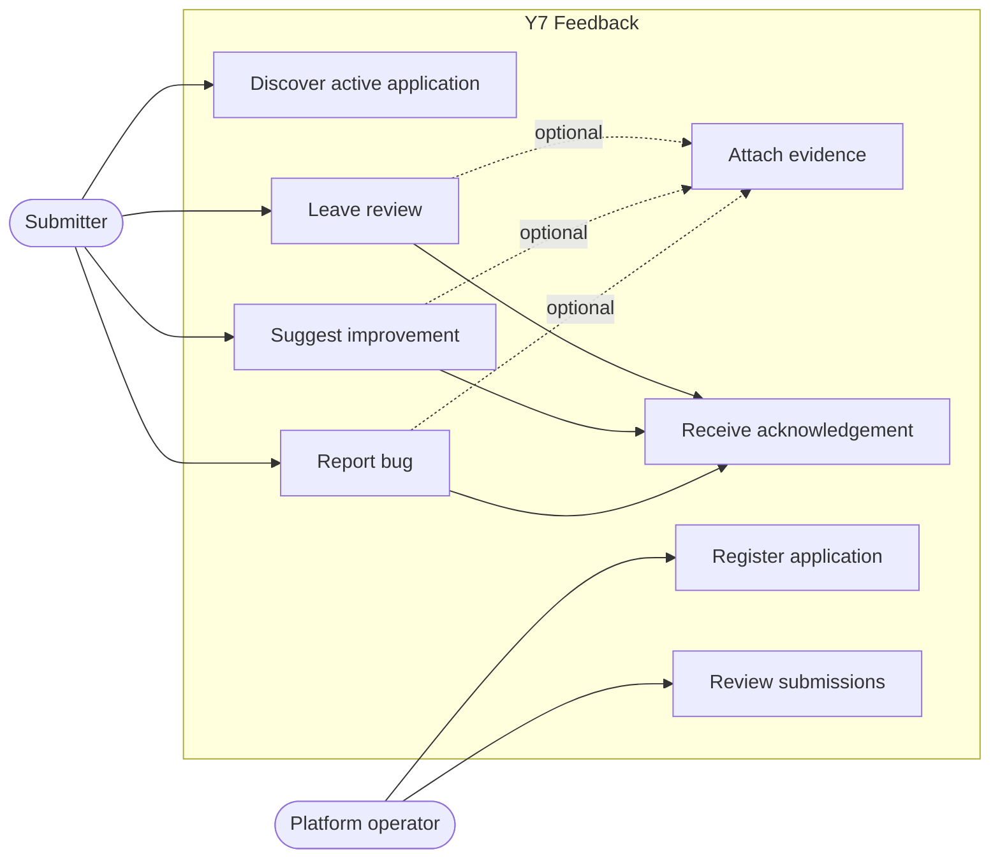
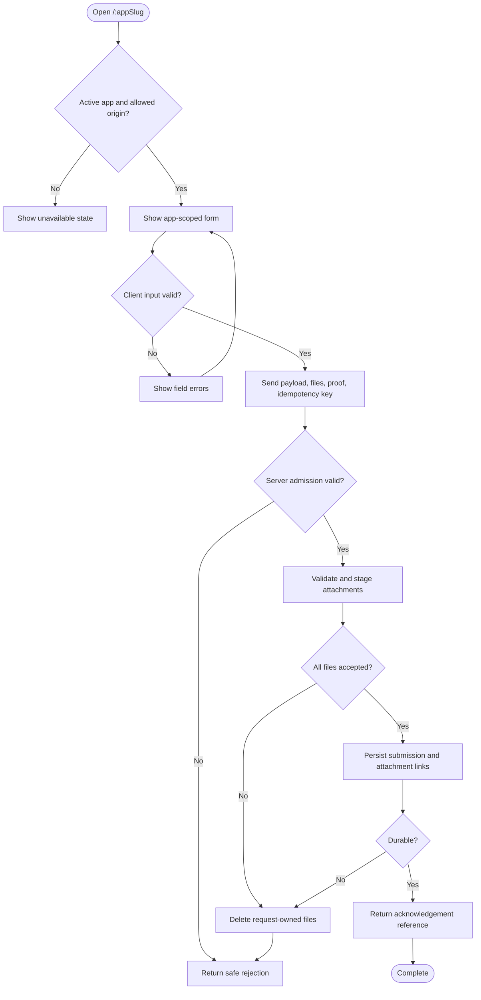
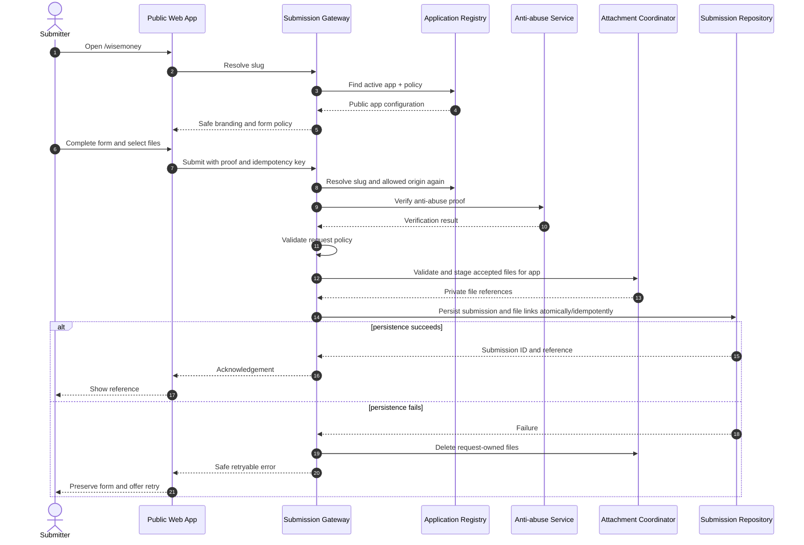
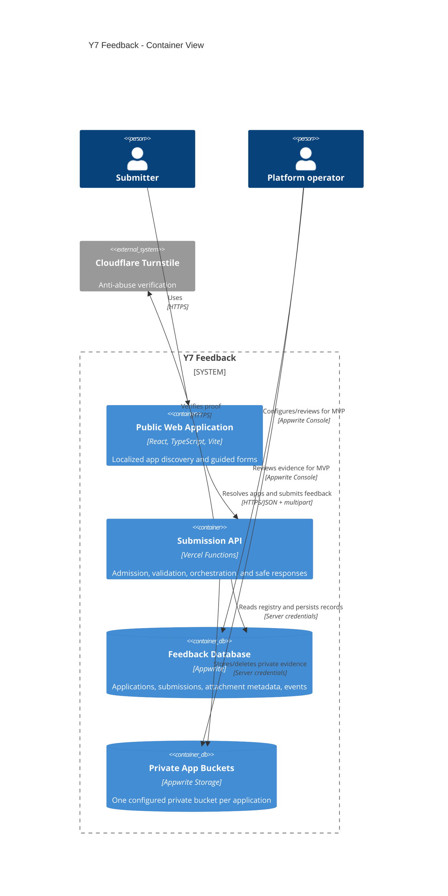
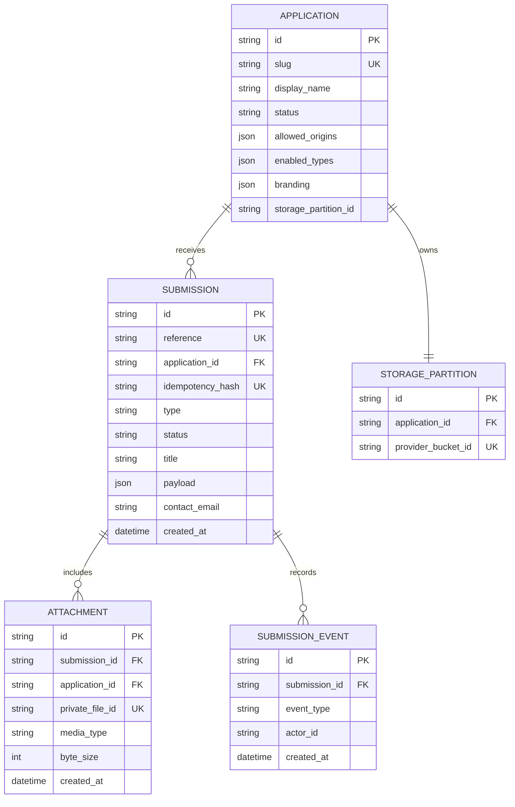

# UML and C4 Modeling - Y7 Feedback

## 1. C4 Context

## 2. UML Use Cases

## 3. Submission Activity

## 4. Submission Sequence

## 5. C4 Container View

## 6. Conceptual Data Model

## 7. Model Review Questions

- Can the chosen persistence boundary provide the required submission/file
  consistency, or must the coordinator implement compensating cleanup?
- Should type-specific fields remain a validated payload or become dedicated
  columns for operator queries?
- Does contact data require a separate retention boundary from submission text?
- How is the idempotency hash expired without allowing delayed duplicates?
- Does one bucket per application remain operationally acceptable at the expected
  number of registered products?
