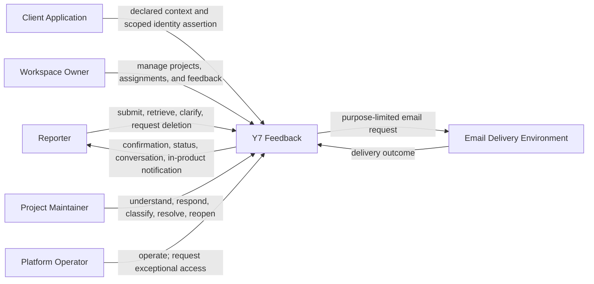
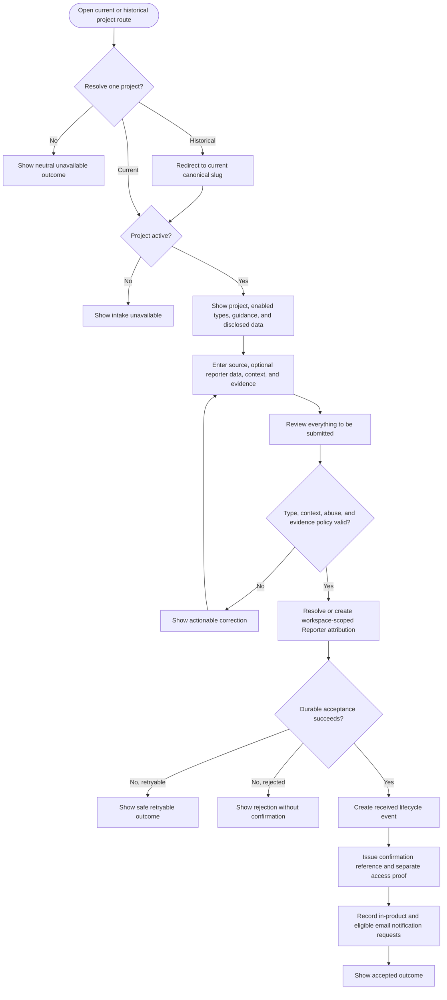
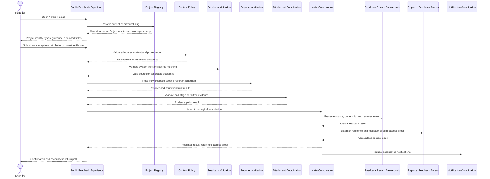
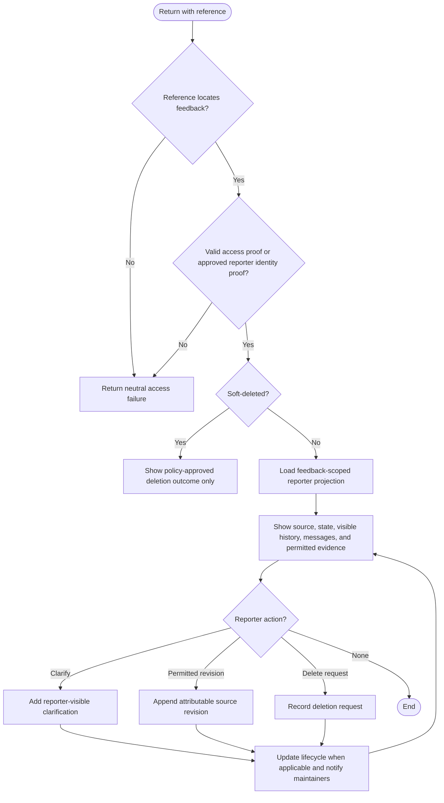
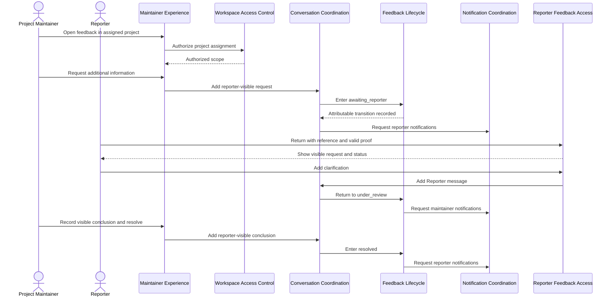
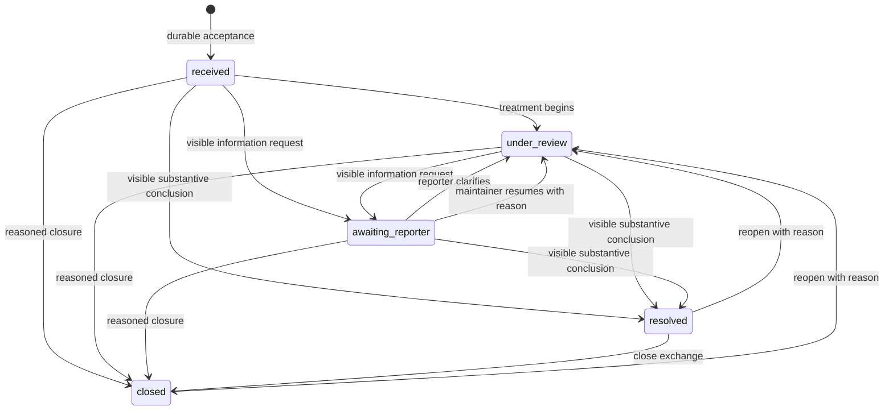
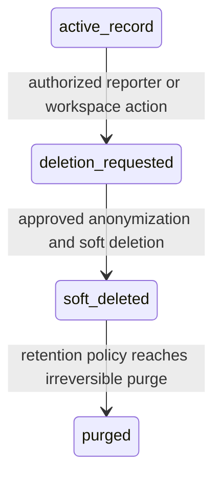
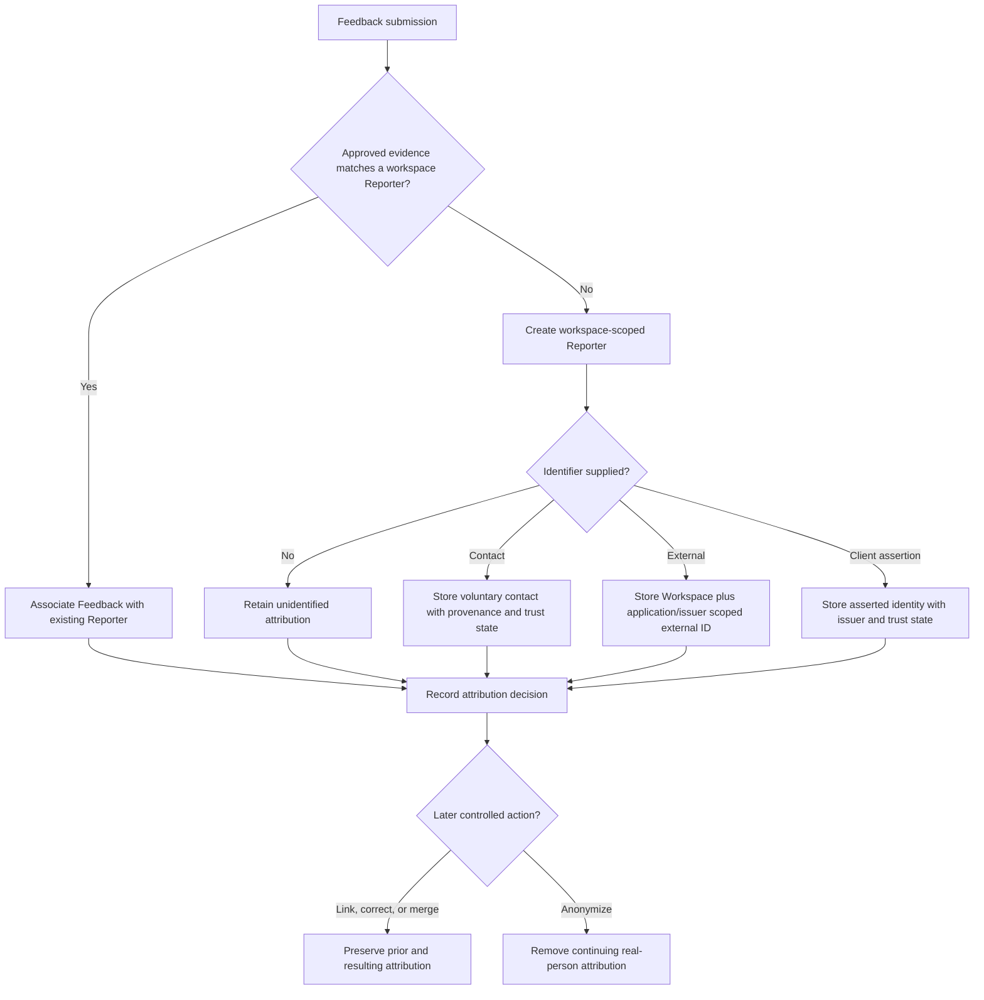

# Behavioral and Domain Models - Y7 Feedback

## 1. Modeling Scope

These models derive behavior and information relationships from the approved
Intent, Requirements, Contract, and Responsibilities. They are conceptual: an
entity is not automatically a database table, a responsibility is not a service,
and a sequence participant is not a deployment unit.

No container, component, persistence, API, or deployment model appears here.

## 2. System Context

The email participant is an environmental capability, not a selected provider.
The Client Application may assert identity only through an approved trusted
interaction; public fields do not establish trust.

## 3. Core Use Cases

| ID | Primary actor | Outcome |
| --- | --- | --- |
| UC-01 | Reporter | Resolve a current or historical Project route and verify the target. |
| UC-02 | Reporter | Submit a structured Bug, Suggestion, or Review with declared Context. |
| UC-03 | Reporter | Add permitted supporting evidence. |
| UC-04 | Reporter | Receive a reference and independent accountless access proof. |
| UC-05 | Reporter | Retrieve status and visible history, clarify, and revise permitted information. |
| UC-06 | Reporter | Request deletion of the accessed Feedback. |
| UC-07 | Workspace Owner | Manage Projects, slugs, and Project Maintainer assignments. |
| UC-08 | Project Maintainer | Work Feedback through clarification, analysis, resolution, closure, and reopening. |
| UC-09 | Reporter / workspace actor | Receive scoped in-product and eligible email notifications. |
| UC-10 | Workspace actor | Filter, relate, theme, and compare Feedback for Product Intelligence. |
| UC-11 | Platform Operator | Operate without standing business-content access and use an audited exceptional grant when authorized. |

Public publication, community voting, arbitrary chat, commercial SaaS behavior,
and autonomous AI decisions are not use cases in this model.

## 4. Feedback Intake Activity

The unresolved Attachment atomicity policy controls whether the reporter must
correct rejected evidence before `Accept` or can explicitly continue without it.
The diagram does not choose that policy.

## 5. Feedback Intake Sequence

Participants express responsibility ownership only. They may be implemented
together.

## 6. Accountless Retrieval Activity

The reference locates; the proof authorizes. Access to this Feedback never
enumerates other Feedback attributed to the same Reporter.

## 7. Clarification and Resolution Sequence

An Internal Note follows a separate internal-only path and never appears in this
Reporter conversation.

## 8. Feedback Lifecycle

- `received` is accepted but not actively treated.
- `under_review` covers understanding, analysis, and action; the model does not
  invent issue-tracker states such as planned or deployed.
- `awaiting_reporter` requires a visible request.
- `resolved` requires a visible substantive conclusion.
- `closed` means no active work or exchange is expected; it is not deletion.
- Every arrow creates a lifecycle event with previous state, next state, actor,
  time, and trigger or reason.

Deletion is an orthogonal record state:

The presence of `purged` does not set its timing; `OPEN-RET-001` must provide the
policy and backup-expiry behavior.

## 9. Reporter Attribution Model

Equal raw identifiers outside the same Workspace and application/issuer scope do
not meet the `Existing` condition. Browser or device fingerprinting is not an
input to this model.

## 10. Conceptual Information Model

```mermaid
erDiagram
    WORKSPACE ||--o{ PROJECT : owns
    WORKSPACE ||--o{ REPORTER : scopes
    WORKSPACE ||--o{ WORKSPACE_ACTOR : authorizes
    WORKSPACE ||--o{ THEME : owns
    WORKSPACE ||--o{ EXCEPTIONAL_ACCESS_GRANT : bounds

    PROJECT ||--o{ PROJECT_SLUG : reserves
    PROJECT ||--o{ FEEDBACK : receives
    PROJECT ||--o{ PROJECT_ASSIGNMENT : defines
    WORKSPACE_ACTOR ||--o{ PROJECT_ASSIGNMENT : receives

    REPORTER ||--o{ REPORTER_IDENTIFIER : has
    REPORTER ||--o{ FEEDBACK : sources

    FEEDBACK ||--o| CONTEXT_SNAPSHOT : captures
    FEEDBACK ||--o{ SOURCE_REVISION : preserves
    FEEDBACK ||--o{ VISIBLE_MESSAGE : converses
    FEEDBACK ||--o{ INTERNAL_NOTE : records
    FEEDBACK ||--o{ ATTACHMENT : includes
    FEEDBACK ||--o{ LIFECYCLE_EVENT : histories
    FEEDBACK ||--o{ ACCESS_GRANT : authorizes
    FEEDBACK ||--o{ NOTIFICATION : triggers
    FEEDBACK ||--o{ THEME_ASSOCIATION : classified_by
    THEME ||--o{ THEME_ASSOCIATION : groups
    FEEDBACK ||--o{ FEEDBACK_RELATION : source
    FEEDBACK ||--o{ FEEDBACK_RELATION : target
    FEEDBACK ||--o{ DELETION_RECORD : governs

    PLATFORM_OPERATOR ||--o{ EXCEPTIONAL_ACCESS_GRANT : receives

    WORKSPACE {
        identifier id
    }
    PROJECT {
        identifier id
        identifier workspace_id
        lifecycle_state state
    }
    PROJECT_SLUG {
        slug value
        slug_state current_or_historical
    }
    REPORTER {
        identifier id
        identifier workspace_id
        attribution_state state
    }
    REPORTER_IDENTIFIER {
        identifier_kind kind
        identifier issuer_or_application
        identifier_scope scope
        trust_state trust
    }
    FEEDBACK {
        identifier id
        identifier project_id
        identifier reporter_id
        feedback_type type
        lifecycle_state current_state
        deletion_state record_state
        timestamp accepted_at
    }
    CONTEXT_SNAPSHOT {
        context_values declared_values
        provenance source_and_purpose
    }
    SOURCE_REVISION {
        revision author_time_reason
    }
    VISIBLE_MESSAGE {
        audience reporter_visible
        author_kind reporter_or_workspace_actor
        timestamp created_at
    }
    INTERNAL_NOTE {
        audience workspace_internal
        identifier author
        timestamp created_at
    }
    ATTACHMENT {
        identifier id
        attachment_metadata approved_metadata
        audience inherited_audience
    }
    LIFECYCLE_EVENT {
        lifecycle_state previous_state
        lifecycle_state next_state
        transition actor_time_reason
    }
    ACCESS_GRANT {
        access_state active_revoked_or_expired
        access_scope feedback_only
    }
    NOTIFICATION {
        recipient_scope recipient_and_audience
        delivery_channel in_product_or_email
        delivery_state outcome
    }
    THEME {
        identifier id
        derived_provenance author_source_time
    }
    THEME_ASSOCIATION {
        derived_provenance author_source_time
    }
    FEEDBACK_RELATION {
        relationship meaning
        derived_provenance author_time
    }
    DELETION_RECORD {
        deletion_state state
        audit requester_actor_time
    }
    WORKSPACE_ACTOR {
        identifier id
        fixed_role workspace_owner_or_maintainer
    }
    PROJECT_ASSIGNMENT {
        identifier project_id
        identifier maintainer_id
    }
    PLATFORM_OPERATOR {
        identifier id
    }
    EXCEPTIONAL_ACCESS_GRANT {
        identifier workspace_id
        access_scope content_scope
        grant_window start_and_expiry
        audit authorizer_purpose_state
    }
```

This model expresses conceptual identity and cardinality, not storage fields.
In particular:

- one unidentified Reporter may be created for a submission without implying
  that unrelated unidentified submissions are the same person;
- controlled attribution changes are historical domain actions, not direct
  foreign-key editing;
- Project slugs are separate conceptual records because current and historical
  values have different route behavior while remaining reserved to one Project;
- Reporter-visible Message and Internal Note are separate concepts because audience is
  an invariant, not a presentation toggle;
- Access Grant is distinct from Reporter Identifier and confirmation reference;
- Theme, association, and relationship are derived records with provenance;
- application, page, screen, feature, version, device, and environment remain
  Context values until an independently justified lifecycle requires new domain
  entities.

## 11. Ownership and Mutability Summary

| Concept | Immutable or append-preserved | Controlled mutable state |
| --- | --- | --- |
| Project | Workspace owner; current and historical slug reservation | Active state, current slug, guidance, enabled types, declared Context |
| Reporter | Workspace scope; identifier provenance history | Identifiers, trust, linkage, correction, anonymization through controlled actions |
| Feedback | Workspace/Project ownership, original source, acceptance time | Reporter attribution through controlled history, current lifecycle state, soft-delete state |
| Message / Internal Note | Feedback, author, audience, creation time | No silent audience conversion; corrections are attributable additions |
| Attachment | Feedback ownership and accepted-policy evidence | Approved retention and deletion state |
| Lifecycle event | Previous/next state, actor, time, reason/trigger | Append only |
| Theme / relationship | Workspace scope, provenance | Accountable correction or removal without source mutation |
| Access Grant | Feedback scope | Active, revoked, or expired |
| Exceptional access grant | Operator, authorizer, purpose, Workspace, time bounds | Revocation before expiry |

## 12. Deferred Architecture Views

Container, component, deployment, and data-store views remain intentionally
absent. They become meaningful only after the remaining requirements provide:

1. Attachment formats, limits, validation, metadata, atomicity, and retention.
2. Retention, irreversible purge, restoration, and backup-expiry policies.
3. Exceptional Platform Operator access approval authority.
4. Quantitative anti-abuse, availability, latency, capacity, viewport, and
   notification-delivery targets.
5. A decision on the exact root `/` experience if it is to drive architecture.

At that point, architecture options can be compared against this behavior and
contract without changing the domain meaning.
