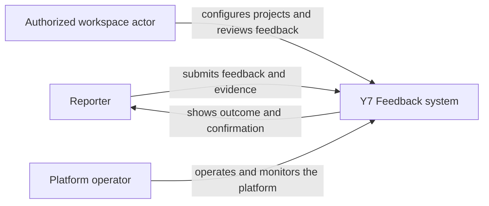
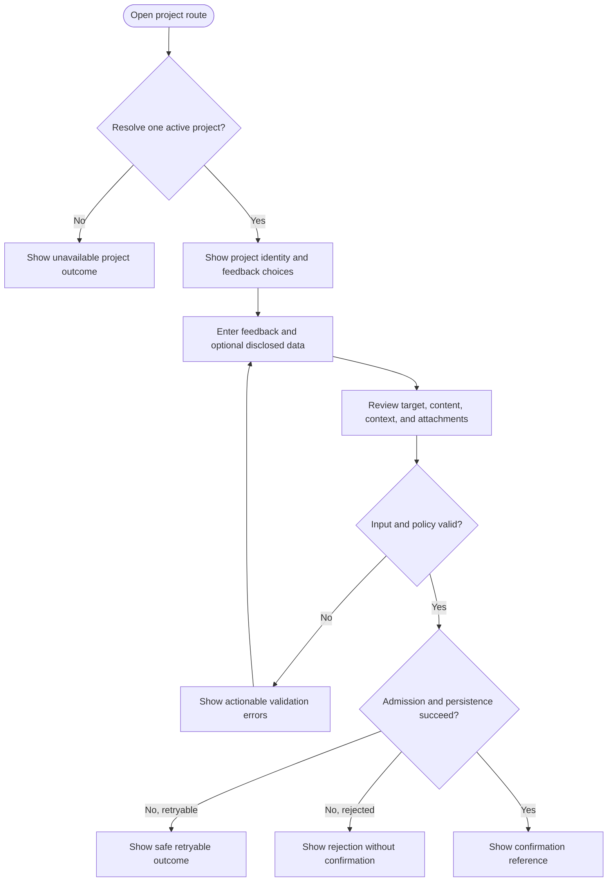
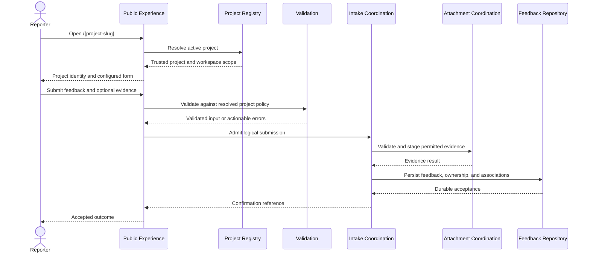
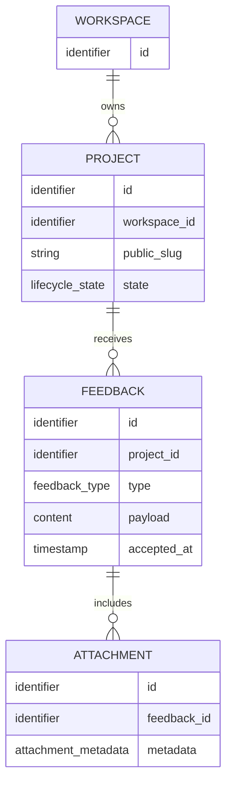

# Behavioral and Domain Models - Y7 Feedback

## 1. Modeling Scope

These models describe actors, behavior, and information ownership. A technical
container architecture is deferred because identity, attachment policy,
operational roles, and measurable service targets remain open.

## 2. System Context

The context intentionally leaves authentication and reporter identity modes
unspecified.

## 3. Core Use Cases

| ID | Actor | Outcome |
| --- | --- | --- |
| UC-01 | Reporter | Resolve a project from its public slug. |
| UC-02 | Reporter | Submit a review, suggestion, or bug report. |
| UC-03 | Reporter | Attach permitted supporting evidence. |
| UC-04 | Reporter | Receive an accurate acceptance or failure outcome. |
| UC-05 | Authorized workspace actor | Configure or deactivate a permitted project. |
| UC-06 | Authorized workspace actor | Retrieve feedback for permitted projects. |
| UC-07 | Platform operator | Diagnose operational failures without exposing protected content. |

Reporter follow-up, replies, public boards, voting, and status tracking are not
core use cases until explicitly approved.

## 4. Submission Activity

## 5. Submission Sequence

Failure paths must follow the acceptance and cleanup guarantees in the core
contract.

## 6. Conceptual Information Model

This is a conceptual model, not a database schema. Reporter identity is absent
because its data model depends on the unresolved identity policy. Feedback
content remains abstract because type-specific schemas are also unresolved.

## 7. Deferred Architecture Views

A container or deployment view becomes meaningful only after decisions establish:

1. identity and authorization boundaries;
2. attachment processing and retention requirements;
3. management-interface scope;
4. availability, latency, scale, and regional requirements;
5. privacy and data-location constraints.

At that point, architecture options can be compared against the same contract
without changing the domain model.
