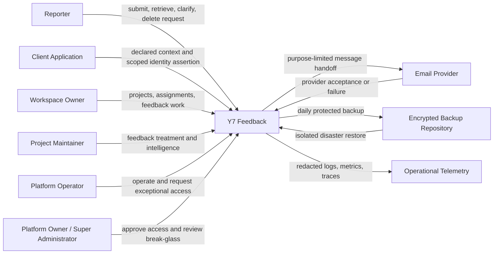
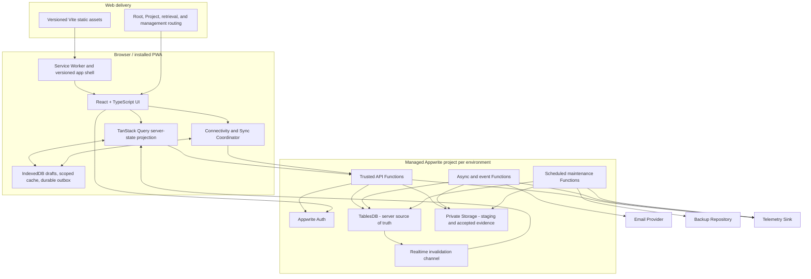
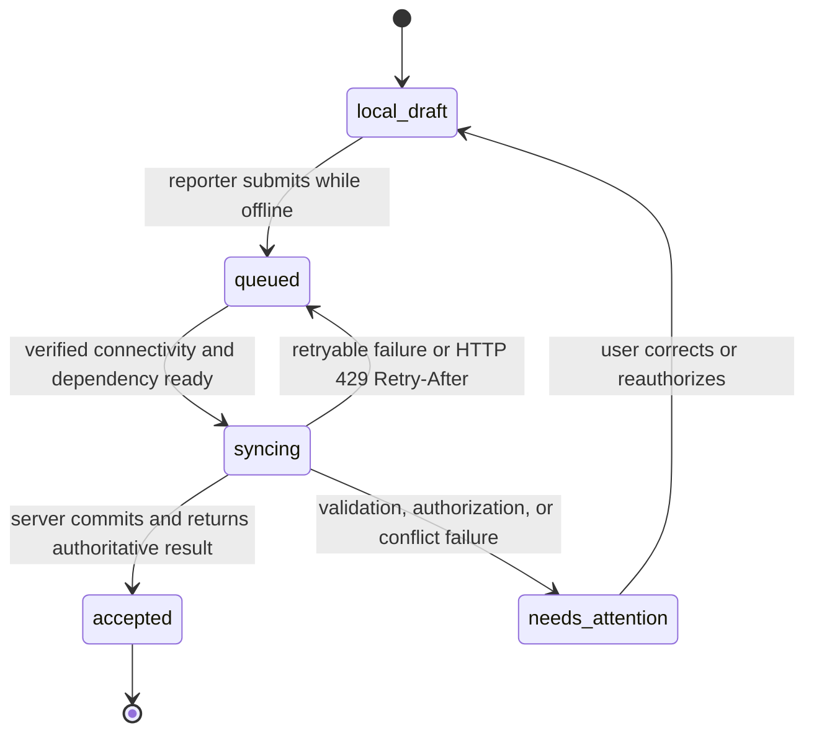
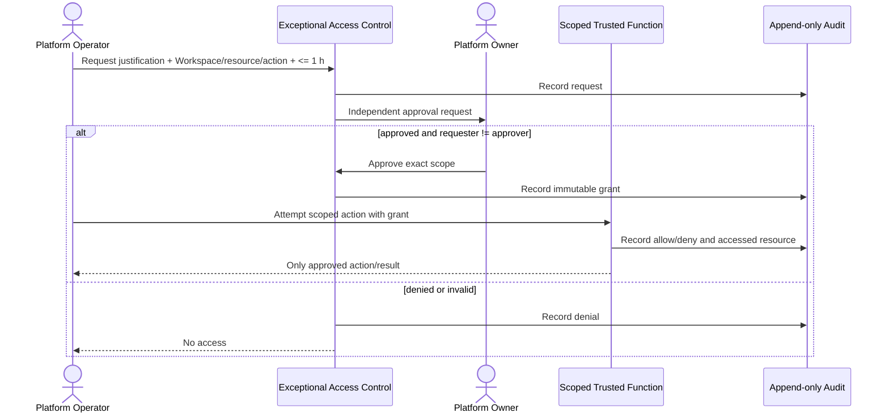

# Y7 Feedback Architecture

## 1. Status, Scope, and Authority

Status: **proposed implementation architecture derived from the validated
product chain**.

This document allocates the responsibilities in `04_RESPONSIBILITIES.md` to the
validated technical stack. It does not change the PRD, SRS, Contract, or domain
model. If an architectural convenience conflicts with an upstream guarantee,
the convenience loses.

This pass defines no application code, database schema, migration, CI/CD,
container, Terraform, or Kubernetes resource.

## 2. Architectural Drivers

The architecture must preserve these properties simultaneously:

- strict Workspace and Project isolation (`FR-OWN-*`);
- a Reporter that is a domain subject, not an Appwrite authentication account;
- secure accountless continuity based on a reference plus independent proof;
- one living Feedback aggregate with conversation, internal notes, lifecycle,
  attachments, history, and Product Intelligence;
- logical all-or-nothing intake with up to five private 10 MB files;
- connectivity-aware PWA behavior without treating local state as authoritative;
- immediate anonymization when required, immediate soft deletion, 30-day purge,
  and safe pre-purge restoration;
- durable in-product and email notification outcomes;
- independently approved, narrowly scoped exceptional access;
- quantitative anti-abuse, recovery, accessibility, and internal SLOs.

The solution must remain the simplest one that satisfies those drivers. A
modular application on managed Appwrite is sufficient; no microservice split,
event-sourcing platform, external search engine, or general message broker is
justified for the MVP.

## 3. System Context



The email, backup, and telemetry boxes are logical external capabilities. Their
vendors are implementation selections, not additional product actors.

## 4. Logical Application Boundaries



### 4.1 One modular backend, three execution modes

The trusted backend shares one domain and policy codebase, deployed through
Appwrite Functions in three modes:

- synchronous API handling for public, accountless, and workspace operations;
- asynchronous event/outbox handling for notifications and non-blocking work;
- scheduled maintenance for purge, staged-file cleanup, reconciliation, backup,
  and recovery verification.

These are execution modes, not independently owned microservices. Domain rules,
authorization, identifiers, and observability conventions remain shared.

### 4.2 Environment isolation

Development, staging, and production use different Appwrite projects, secrets,
Storage buckets, databases, domains, and recipients. No test principal, Access
Proof, API key, or data is valid across environments.

## 5. Frontend Architecture

### 5.1 React and Vite

React owns interaction and projection composition. TypeScript makes command,
result, lifecycle, and local-outbox states explicit. Vite produces immutable,
versioned application assets. The same application may expose public intake,
accountless follow-up, and authenticated management through separate route and
authorization shells; this does not merge their permissions.

The router resolves reserved system routes before the catch-all `/{slug}`
Project route. System route names are reserved from current and historical
Project slugs before issuance. Their exact labels are an implementation choice;
their precedence and reservation are architectural invariants.

At `/`, the public shell provides the three validated bilingual intents without
calling any Project-list or Workspace-list operation. A direct current or
historical Project URL resolves the Project immediately and never depends on the
root experience.

### 5.2 State ownership

| State | Owner | Persistence | Authority |
| --- | --- | --- | --- |
| Render and transient form state | React | Memory | Never authoritative |
| Remote query projection | TanStack Query | Memory plus selected IndexedDB persistence | Server version wins |
| Feedback draft | Sync Coordinator | IndexedDB | Local until accepted |
| Selected Attachment bytes | Sync Coordinator | IndexedDB when browser quota permits | Local staging only |
| Pending mutation | Durable local outbox | IndexedDB | Pending intent, not domain fact |
| Authentication session | Appwrite Auth client/session controls | Browser mechanism approved for Appwrite | Authorizes only mapped workspace actors |
| Accountless Access Proof | Reporter access shell | Memory by default; explicit device retention only | Proof checked by trusted API |
| Application shell assets | Service Worker Cache Storage | Versioned cache | Never business data |

TanStack Query is not used as a second domain database. Its persisted cache is a
discardable projection. IndexedDB is the durable browser mechanism for drafts,
selected safe query data, Attachment blobs, and the command outbox because those
objects must survive refresh and have dependencies that a memory mutation cache
alone cannot safely own.

### 5.3 PWA and cache boundaries

The service worker caches the versioned application shell, localization assets,
and an offline navigation fallback. It does not cache protected API responses or
Attachment downloads in Cache Storage. Sensitive persisted projections are
partitioned by environment, actor/access scope, Workspace, Project, and Feedback
as applicable, and are erased on logout, proof revocation, deletion visibility,
scope removal, or incompatible cache version.

The UI always distinguishes `draft`, `queued`, `syncing`, `accepted`, `failed`,
and `needs attention`. A queued submission never displays a confirmation
reference or claims acceptance.

All core flows remain usable at 320 CSS pixels and expose FR/EN content,
programmatic labels, keyboard operation, non-color state meaning, and stable
input during language changes.

## 6. Appwrite as the Reference Backend

### 6.1 Deployment choice

Use managed Appwrite Cloud for the MVP. It minimizes infrastructure ownership
while supplying Auth, Functions, TablesDB, Transactions, private Storage,
Realtime, schedules, and event triggers in one operational boundary. A selected
Cloud region and plan must be able to meet the recovery, capacity, and SLO
fitness tests. Self-hosting remains a future deployment alternative, not a
second MVP topology.

Frontend static hosting is deliberately replaceable. It must serve the Vite PWA
over TLS at `feedback.y7labs.studio`, support SPA navigation fallback and cache
headers for versioned assets, and preserve the fixed routing contract. Selecting
the static host does not change backend authority.

### 6.2 Trusted Function boundary

All domain reads, writes, searches, aggregates, Attachment transfers, and
accountless operations pass through trusted Functions. The browser may call
Appwrite Auth and subscribe to authorized Realtime channels directly, but it
does not directly mutate TablesDB or private Storage.

This boundary is mandatory because server SDK credentials can bypass Appwrite
row and file permissions. Every Function therefore:

1. authenticates an Appwrite session or validates a Feedback-specific proof;
2. resolves Project and Workspace from server-owned records;
3. maps the principal to fixed domain responsibility and Project assignment;
4. enforces audience, lifecycle, deletion, and exceptional-grant policy;
5. validates input and idempotency;
6. commits through a transaction where multiple TablesDB facts must agree;
7. records a redacted audit/trace result.

Different Function groups receive different least-privilege API keys. Public
intake cannot invoke administrative operations; notification workers cannot
approve access; operators hold no standing data API key.

### 6.3 Persistence responsibilities

TablesDB is the authoritative store for the conceptual records in
`05_MODELING.md`. It also holds supporting consistency records: idempotency
results, notification outbox entries, staged-upload manifests, transient
rate-limit counters, purge evidence, and recovery checkpoints. These support the
contract but are not new product concepts.

Appwrite Transactions commit changes that must be atomically visible, such as a
Feedback, initial lifecycle event, reference verifier, Attachment associations,
in-product notification records, and durable outbox entries. Optimistic version
checks reject conflicting non-append updates; no silent last-write-wins policy is
allowed.

Private Appwrite Storage owns binary evidence. Storage buckets enforce the 10 MB
coarse size and extension allow-list as defense in depth, enable encryption and
antivirus scanning, and grant no public read/list permission. Trusted
actual-content validation remains authoritative.

## 7. Identity and Authorization

### 7.1 Workspace actors

Appwrite Auth authenticates Workspace Owners, Project Maintainers, Platform
Operators, and Platform Owners. Domain role and Project assignment remain in
TablesDB so that changing an authentication method does not change domain
meaning. Production policy requires multi-factor authentication for Platform
Operator and Platform Owner actions and fresh authentication for exceptional
access approval or use.

An authorization decision uses all applicable dimensions:

```text
authenticated principal
  + fixed domain responsibility
  + Workspace membership
  + Project assignment
  + resource audience
  + deletion state
  + exceptional grant, only when required
  -> allow or deny
```

Appwrite row/file permissions provide defense in depth for Realtime and any
permitted direct read, but trusted Function policy is the primary enforcement
point.

### 7.2 Reporter and accountless access

Creating a Reporter does not create an Appwrite Auth user. On acceptance the
server returns:

- a stable, non-secret, human-usable unique reference; and
- a high-entropy Feedback-specific Access Proof whose verifier is stored as a
  one-way hash.

Reference alone never authorizes access. Proof is transmitted in an
authorization header or protected request body, not a query string or log. One
proof cannot enumerate sibling Feedback. Revocation rotates or invalidates the
verifier without changing reference or ownership. Email never contains the
proof. Optional contact- or Client-Application-based recovery must independently
prove the approved identity scope before issuing a replacement proof.

The accountless reporter view is obtained through trusted API projections. It
contains source, reporter-visible history, lifecycle, permitted evidence and
actions, but never Internal Notes, workspace classification internals, or audit
data.

## 8. Online Intake and Attachments

Appwrite Storage cannot participate in a TablesDB transaction. Logical
atomicity is therefore implemented as a bounded saga with private staging.

```mermaid
sequenceDiagram
    actor R as Reporter PWA
    participant API as Trusted Intake Function
    participant Limit as Anti-Abuse Policy
    participant Store as Private Appwrite Storage
    participant Validate as Validation Function
    participant DB as Appwrite TablesDB Transaction
    participant Outbox as Notification Outbox

    R->>API: Begin operation with clientOperationId and manifest <= 5
    API->>Limit: Check 60/min, 10 submissions/min, identity/project limit
    Limit-->>API: Allowed
    loop Each file, maximum five
        R->>API: Upload one file <= 10 MB
        API->>Limit: Check 20 files/min/IP
        API->>Store: Write private staged object
        API->>Validate: Detect actual type, parse, scan, verify
        Validate-->>API: Accepted or rejected; at most 10 MB each and five files
    end
    alt Every supplied file valid
        API->>DB: Transaction: Reporter + Feedback + received + references + Attachment metadata + notifications + outbox
        DB-->>API: Committed once
        API-->>R: Accepted reference and separate proof
    else Any file or commit fails
        API->>Store: Remove operation-owned staged objects
        API-->>R: Rejected or safely retryable; no Feedback success
    end
```

Each upload is mediated by the trusted API so application rate limits and
private storage cannot be bypassed. Before implementation, the selected
Appwrite Cloud runtime must prove that a 10 MB request plus protocol overhead is
supported. If it is not, the same flow uses a Function-issued short-lived
technical upload session restricted to the private staging manifest; it does
not create a Reporter account or public bucket. This is a platform fitness test,
not a product decision.

Validation combines:

- byte limit and five-file manifest enforcement;
- signature/magic-byte detection and format parsing/decoding;
- strict UTF-8 and binary-content rejection for TXT/CSV;
- explicit archive, executable, and polyglot rejection;
- antivirus result;
- a server-derived media type and integrity digest.

Files remain non-domain-visible while staged. A scheduled sweeper removes stale
or rejected objects. After the transaction commits, the accepted object retains
private access and a single Feedback association. Every download goes through
the trusted authorization boundary; ordinary public file tokens are not used as
accountless authorization.

## 9. Offline and Synchronization Model

### 9.1 Required behavior

Offline-first means useful local continuity, explicit pending state, and safe
reconciliation. It does not mean accepting Feedback without the server or making
the browser authoritative.



Connectivity is determined by a small server probe and request outcomes, not
`navigator.onLine` alone. Synchronization runs when the app opens, becomes
visible, detects verified reconnection, or receives a supported background-sync
opportunity. Browser Background Sync is progressive enhancement because it is
not available consistently across browsers.

### 9.2 Durable outbox

Each command has `clientOperationId`, creation time, target scope, dependencies,
payload version, retry state, and optional expected server version. Attachment
blobs are referenced by local object identity. Commands for one Feedback are
ordered; independent Feedback commands may run concurrently within rate limits.

Safe queued commands are append-oriented operations:

- initial Feedback submission and its bounded Attachments;
- Reporter clarification and permitted attributable revision;
- reporter-visible maintainer Message or Internal Note;
- deletion request.

Authority-changing and conflict-sensitive commands require live server
confirmation: Project/slug configuration, Maintainer assignment, lifecycle
transition, deletion execution, restoration, exceptional access, and derived
relationship changes. A future offline version may queue them only with an
explicit conflict workflow; the MVP does not silently replay them.

On reconnect the coordinator:

1. revalidates authentication or Access Proof;
2. sends dependency-ready commands with their original operation identity;
3. respects HTTP 429 and `Retry-After` with jittered backoff;
4. treats an idempotent duplicate as the original domain outcome;
5. replaces optimistic projections with server results;
6. invalidates and refetches affected TanStack Query keys;
7. stops and requests attention on authorization, validation, or version
   conflict rather than overwriting server state.

If browser quota or persistent-storage permission cannot preserve Attachment
blobs, the PWA preserves the textual draft, explains the limitation, and asks
the user to reselect files after reconnection. Successfully synchronized or
discarded blobs are removed promptly.

## 10. Feedback Lifecycle and Consistency

Lifecycle commands execute online through the trusted API with current
authorization and expected-version validation. A TablesDB transaction writes
the new current state, append-only Lifecycle Event, required reporter-visible
Message, in-product notification facts, and outbox entries together.

This enforces:

- `awaiting_reporter` only with a visible information request;
- Reporter clarification returning `awaiting_reporter` to `under_review`;
- `resolved` only with a visible substantive conclusion;
- reasoned reopening of `resolved` or `closed` to `under_review`;
- treatment, Project-active, and deletion states remaining orthogonal;
- original source and every prior transition remaining attributable.

Append-only conversation commands are idempotent by logical operation ID.
Conflicting state changes return a conflict outcome, refresh the server state,
and require an informed retry; they never use last-write-wins.

## 11. Notifications

In-product notification records and a durable delivery outbox are written in
the same TablesDB transaction as their source domain fact. Delivery is therefore
decoupled without risking lost intent or rolling back accepted business state.

For authenticated Workspace actors, Appwrite Realtime sends a permission-scoped
invalidation signal; TanStack Query then refetches the authoritative feed. For a
Reporter without an Appwrite session, the authorized feedback view performs
connectivity-aware polling no slower than every four seconds while visible and
online, plus immediate refetch on focus/reconnect. This satisfies the five-second
in-product P95 without inventing Reporter accounts. Realtime/poll messages are
signals, not the source of notification truth.

The async worker leases outbox entries, renders FR/EN templates, minimizes
sensitive content, and hands eligible email to a configured provider. Provider
acceptance/failure, attempts, and next retry are recorded. The worker targets
provider handoff within 30 seconds; end-recipient delivery is outside that SLO.
Because Appwrite Messaging email targets are tied to Appwrite users, Reporter
email is sent through a Function-owned provider adapter rather than forcing
Reporter records into Appwrite Auth. The concrete provider remains replaceable.

Reconciliation detects stuck leases and undelivered entries. Duplicate delivery
is minimized with stable notification identity and provider idempotency where
available; the domain action is never duplicated.

## 12. Product Intelligence

The MVP queries authoritative structured source and provenance data in TablesDB
through Workspace- and Project-scoped Functions. Purpose-built indexes support
type, state, time, Project, Reporter association, version, page/screen, feature,
theme, and declared Context filters. Themes and relationships remain derived,
attributable records.

Start with indexed operational queries. Introduce asynchronously maintained
aggregate rows only when representative load tests show they are needed for the
one-second Dashboard P95; every aggregate retains a refresh time and can be
rebuilt from source. No external search engine or AI pipeline is needed for MVP
compliance.

## 13. Anti-Abuse

Application limits run at the trusted public boundary because Appwrite's own
route-specific limits do not express every validated dimension and server SDK
requests can bypass built-in client limits.

For IP dimensions, the Function computes an HMAC of the normalized source IP
with a rotating secret and stores only short-lived keyed counters. Current and
previous rotation windows preserve correct boundary behavior; expired counters
are purged. Raw IP is not retained as a behavioral history.

Transactions or atomic field operations enforce overlapping token/sliding-window
bounds:

| Dimension | Bound |
| --- | --- |
| Public/accountless requests per IP | 60/minute |
| Feedback submission attempts per IP | 10/minute |
| File upload attempts per IP | 20/minute |
| Accepted Feedback per external identity issuer/application scope and Project | 30/hour |

Excess returns HTTP 429 with a safe `Retry-After`, increments no domain effect,
and reveals no protected existence. Offline replay obeys the same gate. CAPTCHA
is not on the required path; adding adaptive challenges later would require a
separate product/security decision.

## 14. Platform Operator and Break-Glass

Ordinary Platform Operator access is limited to redacted operational telemetry,
health, deployment, queue, and recovery state. Operators do not hold standing
TablesDB or Storage content credentials.



Expiry is absolute at one hour; continuing requires a new grant. Function
permissions expose no audit update/delete path to the operator. Break-glass uses
an explicit critical-incident flag, the same justification/scope/audit path, and
cannot close until a Platform Owner records post-incident review. Audit writes
fail closed for content access: an action that cannot be audited is denied.

## 15. Deletion, Retention, Backup, and Recovery

### 15.1 Business deletion

The authorized delete operation uses a TablesDB transaction to:

- mark Feedback and Feedback-owned records soft-deleted immediately;
- remove them from every ordinary query and notification path;
- irreversibly detach/directly anonymize Reporter identifiers when required;
- revoke Feedback Access Proofs;
- make accepted Attachments unavailable;
- append minimal deletion and purge-eligibility evidence.

An authorized workspace actor holding the explicit restoration capability may
restore before purge through an audited online operation. The restore returns
non-anonymized business content and Attachments to their permitted projections,
but cannot recreate identifiers already anonymized.

An hourly scheduled Function purges eligible Feedback aggregates and Storage
objects whose deletion time is at least 30 days old. It writes a minimal purge
checkpoint and makes no business restoration path available. Idempotent retries
and a reconciliation scan handle partial Storage/database deletion failures.

### 15.2 Backup and disaster recovery

At least daily, a controlled backup job captures TablesDB, private Storage, and
critical Appwrite configuration into an encrypted, access-controlled repository
separate from the live project. Each set expires after 30 days. Native Appwrite
database backups may form part of the mechanism, but the recovery design does
not assume they cover Storage or all critical configuration unless the selected
service contract proves it.

Recovery restores into an isolated environment, validates integrity, reapplies
the deletion/purge ledger, and runs isolation and smoke checks before traffic is
enabled. A representative restore exercise must demonstrate no more than 24
hours of committed data loss and service restoration within four hours.
Recovery is exercised at least quarterly and after material persistence changes;
the exercise cadence is an architecture control used to make the RPO/RTO
testable, not a commercial promise.

## 16. Observability and SLO Control

All request and asynchronous paths carry a correlation ID and structured event
names. Telemetry is redacted before export and excludes Access Proofs,
credentials, Attachment bytes, Internal Notes, and unapproved Reporter or source
content.

| Objective | Measurement point | Architectural tactic |
| --- | --- | --- |
| Availability >= 99.9%/month | External bilingual root, active Project resolution, trusted API health | Managed Appwrite, synthetic probes, dependency health, error-budget alerts |
| LCP P75 <= 2.5 s | Real-user navigation | Small versioned shell, route-level loading, optimized critical assets |
| INP P75 <= 200 ms | Real-user interaction | Bounded React work, deferred noncritical rendering, measured interaction paths |
| CLS P75 <= 0.1 | Real-user layout | Reserved media/layout dimensions and stable shell |
| Critical API P95 <= 500 ms | Trusted Function ingress to response | Indexed scoped queries, bounded payloads, no email in request path |
| Feedback creation P95 <= 1 s excluding upload | Complete validated command to commit response | One bounded TablesDB transaction and idempotency lookup |
| Dashboard P95 <= 1 s | Authorized dashboard request | Scoped indexes; aggregates only if load evidence requires them |
| Upload processing P95 <= 2 s | Complete file receipt to validation outcome | 10 MB bound, dedicated validation path, no domain commit before result |
| In-product notification P95 <= 5 s | Source commit to authorized feed visibility | Transactional record, Realtime invalidation or <=4 s visible polling |
| Email-provider handoff P95 <= 30 s | Source commit to provider acceptance | Durable outbox, prompt worker trigger, retry/reconciliation |
| RPO <= 24 h; RTO <= 4 h | Recovery exercise | Daily complete backup, isolated restore, deletion replay, drills |

Metrics use eligible production observations and a documented monthly
calculation policy. Client rejection, invalid authorization, rate limiting, and
end-recipient email delivery are separated rather than distorting service
latency. Errors are measured, not silently excluded from availability.

Before production release, repeatable load tests declare the supported
throughput/concurrency envelope within which the latency SLOs hold. Capacity is
increased only from evidence: query/index tuning first, then Function concurrency
and Appwrite plan resources, and only then a justified boundary split.

## 17. Security and Privacy Posture

- TLS protects every browser, provider, backup, and telemetry connection.
- Secrets live in Appwrite Function secret variables or the selected secret
  facility; none enters Vite assets, IndexedDB, logs, email, or source control.
- Content Security Policy, strict output encoding, dependency controls, and
  Trusted Types where feasible reduce XSS risk to locally cached business data.
- Workspace/Project scope derives from authoritative records, never public body
  fields.
- File downloads use safe content disposition, derived media type, and
  `nosniff`; active content is never served inline.
- Exported logs and metrics contain opaque identifiers only where operationally
  necessary and respect their own retention policy.
- Privileged grants, recovery access, and backup credentials are separated by
  least privilege and independently auditable.

## 18. Requirement-to-Architecture Allocation

| Requirement area | Primary architectural realization |
| --- | --- |
| FR-OWN, FR-PROJ | Trusted Functions, TablesDB ownership keys, reserved router precedence, scoped indexes |
| FR-REP, FR-ACC | Reporter tables, application-scoped identifiers, hashed Access Proof verifier, accountless API projection |
| FR-FDB, FR-CTX, FR-CONV, FR-LIFE | Modular domain policy, TablesDB transactions, append-preserved events, idempotency |
| FR-ATT, NFR-CON | Private staging/accepted Storage, trusted validators, manifest saga, cleanup and transaction |
| FR-OPS | Appwrite Auth, domain role/assignment records, scoped Functions, exceptional-grant control plane |
| FR-NOT | Transactional in-product records and outbox, Realtime/refetch, reporter polling, email adapter |
| FR-INT | Scoped indexed TablesDB queries and rebuildable aggregates only when evidenced |
| FR-PRIV, NFR-REC | Transactional soft delete/anonymization, hourly purge, daily full backup, isolated restore and deletion replay |
| NFR-SEC | Trusted boundary, short-lived HMAC counters, least privilege, safe errors/logs |
| NFR-UX | Responsive bilingual React shells, PWA draft continuity, accessibility tests |
| NFR-SLO | RUM, server histograms, synthetic probes, outbox timing, recovery/load exercises |

## 19. Architectural Fitness Tests

Before implementation is considered releasable, evidence must show:

1. cross-Workspace denial for every protected data and aggregate path;
2. reference-only and sibling-proof accountless access denial;
3. full submission rejection and staged cleanup for each invalid Attachment;
4. actual-content rejection despite a permitted extension/MIME declaration;
5. idempotent replay after response loss and offline reconnection;
6. conflict detection without last-write-wins;
7. all four anti-abuse dimensions and safe HTTP 429 outcomes;
8. operator self-approval/audit-tampering denial and one-hour expiry;
9. pre-purge restore without identity resurrection and definitive post-purge
   denial;
10. complete backup restore inside RPO/RTO with deletion replay;
11. FR/EN, accessibility, 320 px, Web Vitals, API, upload, Dashboard, and
    notification objectives under the declared capacity envelope;
12. an Appwrite Cloud upload path capable of the validated 10 MB file plus
    protocol overhead without opening Storage publicly.

## 20. Remaining Decisions

No remaining product decision blocks this logical architecture. The following
selections are intentionally deferred to implementation or production readiness
because they do not alter the validated behavior:

- static asset host and edge routing implementation;
- Appwrite Cloud region and capacity plan, subject to privacy and SLO evidence;
- workspace-actor login methods and account recovery details within Appwrite
  Auth; MFA remains mandatory for platform privileged actions;
- email provider, telemetry product, and encrypted backup repository;
- validation libraries and antivirus engine configuration;
- exact persisted-query cache allow-list and browser storage budgets;
- exact system route labels reserved from Project slugs;
- retention periods for exceptional-access audit and operational telemetry,
  which require a governance policy before production;
- assignment of the restoration capability among the fixed workspace roles;
- documented SLO eligibility/calculation rules and alert thresholds;
- the controlled-upload transport branch after the 10 MB Appwrite Cloud fitness
  test.

The upload fitness test and governance retention policy are production gates,
not reasons to reopen the domain model or select another backend prematurely.

## 21. Technical Evidence

The design relies on current official capabilities and constraints:

- [Appwrite Transactions](https://appwrite.io/docs/products/databases/transactions)
  for atomic TablesDB changes;
- [Appwrite Functions](https://appwrite.io/docs/products/functions) and
  [function execution](https://appwrite.io/docs/products/functions/execute) for
  HTTP, event, async, and scheduled work;
- [Appwrite permissions](https://appwrite.io/docs/advanced/security/permissions)
  for row/file defense in depth and the documented Server SDK bypass;
- [Appwrite Storage](https://appwrite.io/docs/products/storage/buckets) and
  [upload behavior](https://appwrite.io/docs/products/storage/upload-download)
  for private bounded files and chunking above 5 MB;
- [Appwrite Realtime](https://appwrite.io/docs/apis/realtime) for
  permission-scoped authenticated invalidation;
- [Appwrite offline guidance](https://appwrite.io/docs/products/databases/offline)
  for local-first synchronization principles;
- [Appwrite rate limits](https://appwrite.io/docs/advanced/security/rate-limits)
  for the reason application-specific limits stay in the trusted boundary;
- [Appwrite Cloud backups](https://appwrite.io/docs/products/databases/backups)
  and [self-hosted backup guidance](https://appwrite.io/docs/advanced/self-hosting/production/backups)
  for recovery scope and verification;
- [TanStack Query mutations](https://tanstack.com/query/latest/docs/framework/react/guides/mutations)
  for paused/retried mutation behavior;
- [PWA data storage](https://web.dev/learn/pwa/assets-and-data) and
  [service-worker behavior](https://web.dev/learn/pwa/service-workers) for the
  separation of application assets, IndexedDB data, and progressive offline
  execution.
