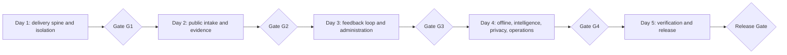

# One-Week Delivery Sprint - Y7 Feedback

## 1. Sprint Contract

| Field | Locked value |
| --- | --- |
| Sprint | `S-01` |
| Dates | 10-14 August 2026 |
| Duration | Five working days |
| Delivery capacity | One implementer |
| Scope source | Every normative requirement in `01_PRD.md` through `06_DECISION_TRACEABILITY.md`, allocated by `07_ARCHITECTURE.md` and `08_ARCHITECTURE_DECISIONS.md` |
| Scope policy | No reduced scope, prototype substitute, mock-backed acceptance, or silent deferral |
| Deployment target | Vercel-hosted PWA with Appwrite as the production backend |
| Sprint outcome | A deployed Y7 Feedback system whose documented requirements have implementation evidence or are explicitly reported incomplete |

Time-box expiry does not convert an unverified task into a completed task.

## 2. Sprint Goal

Build the complete system described by the approved documents: bilingual root
and Project intake, Reporter attribution and accountless continuity,
Attachments, offline-aware PWA behavior, Workspace administration, Feedback
conversation and lifecycle, notifications, Product Intelligence,
deletion/recovery, anti-abuse, exceptional platform access, and observable
service objectives.

Every task follows this evidence chain:

```text
Task
  -> Requirement IDs
  -> Contract invariant or guarantee
  -> Responsible domain
  -> Architecture section / ADR
  -> Executable or operational evidence
```

## 3. Day-1 Preconditions

| ID | Required input | Verification |
| --- | --- | --- |
| PRE-001 | Production and non-production Appwrite projects | Separate endpoints, IDs, databases, Storage, secrets, and recipients are observable. |
| PRE-002 | Vercel project and `feedback.y7labs.studio` control | Preview deploy succeeds and production-domain ownership is verifiable. |
| PRE-003 | Email-provider test and production credentials | Provider accepts a test message containing no Access Proof. |
| PRE-004 | Encrypted backup repository | Test artifact can be written, restored, and expired by policy. |
| PRE-005 | Operational telemetry destination | Redacted logs, metrics, and Web Vitals can be observed. |
| PRE-006 | Two independent platform principals | Requesting Platform Operator and different Platform Owner prove non-self-approval. |
| PRE-007 | Appwrite 10 MB Function ingress result | A 10 MB fixture plus overhead passes, or ADR-005 is reopened before Attachment implementation. |

`PRE-006` requires two distinct operational principals even though one person is
developing the application. Development capacity and production approval
separation are different concerns.

## 4. Definition of Done

A task is `DONE` only when all applicable conditions hold:

1. implementation is committed, reviewable, and deployable;
2. every listed requirement has executable or operational acceptance evidence;
3. negative authorization and failure paths are tested;
4. scope is enforced at a trusted Appwrite Function boundary;
5. retries are idempotent and local state is never presented as server
   acceptance;
6. affected screens pass FR/EN, keyboard, accessible-name, non-color, and 320 px
   checks;
7. protected content, proofs, notes, and secrets are absent from logs and Vercel
   caches;
8. tests and static quality checks pass from a clean environment;
9. deployed preview smoke tests pass;
10. evidence is linked from the task record.

Permitted states are `TODO`, `IN_PROGRESS`, `BLOCKED`, and `DONE`. “Mostly done”,
“UI done”, and “works locally” are not accepted states.

## 5. Daily Phases and Gates



### Day 1 - Delivery spine, persistence, routing, and isolation

Deliver Vercel/Appwrite environments, React/Vite/PWA shell, trusted Functions,
authoritative ownership, Appwrite Auth mapping, root/Project routing, baseline
tests, observability, and the 10 MB upload fitness result.

**Gate G1:** two Workspaces and Projects exist; cross-Workspace access is denied;
root, current slug, historical redirect, and unavailable route pass in FR/EN;
preview has no production secrets; the upload fitness result is recorded.

### Day 2 - Reporter, intake, accountless access, and Attachments

Deliver the three Feedback types, Context review, Reporter attribution,
idempotent acceptance, confirmation reference/proof, private staging,
actual-content validation, atomic Attachment commit, and controlled download.

**Gate G2:** unidentified and externally identified Reporters can submit and
retrieve; reference alone is denied; seven formats pass; spoofed, archive,
executable, oversized, and sixth-file cases fail; a failed file leaves neither
Feedback success nor durable orphan.

### Day 3 - Workspace work, conversation, lifecycle, and notifications

Deliver Project/assignment administration, maintainer dashboard, visible
Messages, Internal Notes, lifecycle/reopening/history, in-product notifications,
and provider email handoff.

**Gate G3:** Reporter-to-Maintainer clarification, resolution, closure, and
reopening pass end to end; Internal Notes never reach Reporter/email;
assignment removal ends access; notification failure preserves the source fact;
notification timings are measured.

### Day 4 - Offline behavior, intelligence, privacy, and platform control

Deliver IndexedDB drafts/cache/outbox, reconnect/idempotency/conflict behavior,
filters/themes/relationships/trends, deletion/anonymization/restore/purge,
anti-abuse, backup/restore, and exceptional access/break-glass.

**Gate G4:** offline submission synchronizes once; conflict never overwrites
server state; Intelligence is scoped; deleted data disappears; clock-controlled
30-day purge passes; restored backup reapplies deletion; all limits return 429;
operator cannot self-approve, exceed one hour, or modify its audit.

### Day 5 - Complete verification and release

Run traceability, isolation/security regression, FR/EN, accessibility, 320 px,
load/performance, recovery, production smoke, and rollback exercises.

**Gate G5:** every task below is `DONE`; every normative requirement has proof;
production and rollback smoke pass; no high-severity security, data-loss,
isolation, or accessibility defect remains.

Monthly SLOs cannot accumulate one month of observations in this sprint. Day 5
must prove instrumentation, calculation rules, alerting, synthetic availability,
and the load-tested envelope. The 99.9% result becomes observable after the
first complete reporting month.

## 6. Traceable Domain Backlog

### 6.1 Delivery and quality spine

| Task | Day | Trace | Outcome | Required evidence | Depends on |
| --- | --- | --- | --- | --- | --- |
| TASK-DEL-001 | 1 | ADR-001, ADR-002, ADR-012 | Reproducible React/TypeScript/Vite PWA and modular Appwrite Function workspace. | Clean install/build/typecheck/test; client assets contain no secret. | PRE-001, PRE-002 |
| TASK-DEL-002 | 1 | NFR-EVO-001..005; Architecture 4.2 | Separate preview/production Appwrite and Vercel configuration. | Preview cannot read production data; cross-environment IDs/tokens fail. | TASK-DEL-001 |
| TASK-TEST-001 | 1 | NFR-CON-001..004; NFR-UX-001..006 | Unit, integration, contract, and browser E2E harnesses with deterministic fixtures. | Passing and deliberately failing proof at every layer. | TASK-DEL-001 |
| TASK-OBS-001 | 1 | NFR-SEC-005..006; NFR-SLO-001..010; ADR-011 | Correlation IDs, redacted logs, metrics, traces, RUM, and probes. | No prohibited fixture payload; each SLO has a populated measurement series. | PRE-005, TASK-DEL-001 |
| TASK-VER-001 | 1 | ADR-012; NFR-SLO-002..004 | Vercel domain, SPA fallback, safe PWA caching, and preview isolation. | Deep link and cache-header tests; no protected Appwrite response in Vercel cache. | TASK-DEL-002 |

### 6.2 Workspace, Project, routing, and authorization

| Task | Day | Trace | Outcome | Required evidence | Depends on |
| --- | --- | --- | --- | --- | --- |
| TASK-OWN-001 | 1 | FR-OWN-001..007; INV-OWN-001..006; ADR-002 | Authoritative ownership and trusted scope derivation. | Two-Workspace matrix denies cross-scope CRUD, search, aggregates, files, notifications, and Realtime. | TASK-DEL-001, TASK-TEST-001 |
| TASK-PROJ-001 | 1 | FR-PROJ-001..010; INV-ROUTE-001 | Project state, global slug reservation, redirects, bilingual root, and neutral unknown route. | Collision/non-reassignment/root-enumeration/direct-route suite passes. | TASK-OWN-001, TASK-VER-001 |
| TASK-AUTH-001 | 1 | FR-OPS-001..006, 010; INV-AUTH-001..002 | Appwrite Auth mapping for Owners, Maintainers, assignments, and trusted Functions. | Owner/assigned matrix passes; unassigned and removed Maintainer fail. | TASK-OWN-001, PRE-006 |
| TASK-ADMIN-001 | 3 | FR-OPS-002..006, 010 | First-party Project, type, Context, slug, activation, and assignment administration. | UC-07 passes without Appwrite Console; invalid operations leave state unchanged. | TASK-PROJ-001, TASK-AUTH-001 |

### 6.3 Reporter, source, Context, and access

| Task | Day | Trace | Outcome | Required evidence | Depends on |
| --- | --- | --- | --- | --- | --- |
| TASK-REP-001 | 2 | FR-REP-001..009; INV-REP-001 | Unidentified, contact, issuer-scoped external ID, and trusted assertion attribution. | Cross-issuer/Workspace IDs do not merge; public ID remains unverified; no fingerprinting. | TASK-OWN-001 |
| TASK-FDB-001 | 2 | FR-FDB-001..006, 009; FR-CTX-001..005; INV-SOURCE-001; INV-CTX-001 | FR/EN Bug, Suggestion, Review and intentional Context review. | Required semantics, optional fields, malformed Context, and source-preservation suite. | TASK-PROJ-001, TASK-REP-001 |
| TASK-ACC-001 | 2 | FR-ACC-001..007; INV-ACCESS-001; ADR-004 | Stable reference, hashed Feedback proof, revocation/replacement, and Reporter projection. | Reference-only, invalid, revoked, and sibling proofs disclose nothing. | TASK-FDB-001 |
| TASK-INTAKE-001 | 2 | FR-FDB-007..009; NFR-CON-001..004; INV-ACCEPT-001; ADR-006 | Idempotent transaction for Reporter, source, Context, `received`, reference, proof verifier, history, notification, and outbox. | Response-loss retry creates one effect; forced failure returns no success/reference. | TASK-REP-001, TASK-FDB-001, TASK-ACC-001 |

### 6.4 Attachments

| Task | Day | Trace | Outcome | Required evidence | Depends on |
| --- | --- | --- | --- | --- | --- |
| TASK-ATT-001 | 1 | FR-ATT-006..010; ADR-005 | Prove 10 MB Function transport or reopen ADR-005 without public Storage. | Boundary fixture plus protocol overhead completes and result is recorded. | PRE-007 |
| TASK-ATT-002 | 2 | FR-ATT-001..013; INV-ATT-001..003 | Private staging and actual-content validation for JPEG, PNG, WebP, GIF, PDF, TXT, CSV. | Format corpus, spoof, polyglot, malware fixture, 10 MB, archive/executable, and sixth-file tests. | TASK-ATT-001, TASK-INTAKE-001 |
| TASK-ATT-003 | 2 | FR-ATT-004..005, 009..013; NFR-CON-001..003 | Atomic manifest, cleanup/reconciliation, audience download, and Feedback lifecycle binding. | Any-file failure accepts nothing; no orphan; Reporter cannot read internal evidence; delete hides files. | TASK-ATT-002 |

### 6.5 Conversation, lifecycle, workspace work, and notifications

| Task | Day | Trace | Outcome | Required evidence | Depends on |
| --- | --- | --- | --- | --- | --- |
| TASK-CONV-001 | 3 | FR-CONV-001..005; INV-VIS-001..002 | Separate append-preserved visible Messages and Internal Notes. | Audience conversion fails; Reporter outputs reveal no Internal Note content/existence. | TASK-AUTH-001, TASK-ACC-001 |
| TASK-LIFE-001 | 3 | FR-LIFE-001..010; INV-LIFE-001..002 | Exact states, valid transitions, request, resolution, closure, and reopening. | Complete transition matrix; invalid transition preserves state/history; every event attributable. | TASK-CONV-001, TASK-INTAKE-001 |
| TASK-WORK-001 | 3 | FR-OPS-005..007, 010 | Maintainer inbox/detail/dashboard with files, notes, history, lifecycle, classification, and deletion. | UC-08 passes in assigned Project and fails without disclosure out of scope. | TASK-ADMIN-001, TASK-LIFE-001 |
| TASK-NOT-001 | 3 | FR-NOT-001, 003..006; INV-NOTIFY-001; NFR-SLO-009 | Transactional in-product feed, actor Realtime invalidation, Reporter polling. | Recipient matrix passes; source-to-visible P95 <=5 s; Realtime loss recovers by refetch. | TASK-INTAKE-001, TASK-LIFE-001 |
| TASK-NOT-002 | 3 | FR-NOT-002..007; NFR-SLO-010; ADR-007 | Durable email outbox, FR/EN templates, provider retry/reconciliation. | Failure preserves source; templates contain no proof/note; provider-handoff P95 <=30 s. | PRE-003, TASK-NOT-001 |

### 6.6 Offline PWA and synchronization

| Task | Day | Trace | Outcome | Required evidence | Depends on |
| --- | --- | --- | --- | --- | --- |
| TASK-PWA-001 | 4 | ADR-003, ADR-012; NFR-UX-001..006 | Installable shell, offline navigation, safe updates, no protected Cache Storage. | Install/offline/reload/update suite and approved-cache inventory pass. | TASK-VER-001 |
| TASK-OFF-001 | 4 | ADR-003; NFR-CON-001..004; NFR-SEC-001 | Versioned IndexedDB drafts, file blobs, partitioned projections, and durable outbox. | Reload preservation, scope erasure, and quota-failure behavior pass. | TASK-PWA-001, TASK-ATT-003 |
| TASK-OFF-002 | 4 | FR-FDB-007..009; FR-ACC-004, 007; FR-CONV-001..004; ADR-003, ADR-006 | Probe, ordered replay, idempotency, dependencies, Retry-After, and conflicts. | Offline operations sync once; 429 pauses; conflict requests attention and never overwrites. | TASK-OFF-001, TASK-CONV-001 |

### 6.7 Product Intelligence

| Task | Day | Trace | Outcome | Required evidence | Depends on |
| --- | --- | --- | --- | --- | --- |
| TASK-INT-001 | 4 | FR-INT-001..002, 005, 008..010 | Filters/aggregates by Project, type, state, time, Reporter, version, place, feature, and Context. | Expected dataset groups/trends; cross-scope and deleted data never contribute. | TASK-WORK-001, TASK-REP-001 |
| TASK-INT-002 | 4 | FR-INT-003..007; INV-INTEL-001..002 | Attributable Themes, associations, relationships, provenance, correction/removal. | Cross-Workspace relation fails; removal leaves source; provenance is visible. | TASK-INT-001 |

### 6.8 Privacy, recovery, anti-abuse, and Platform Operator

| Task | Day | Trace | Outcome | Required evidence | Depends on |
| --- | --- | --- | --- | --- | --- |
| TASK-PRIV-001 | 4 | FR-PRIV-001..009; FR-ACC-007; INV-DELETE-001; ADR-009 | Request, immediate soft delete/anonymization/revocation, restore, hourly purge, and file lifecycle. | Ordinary absence, identity search denial, no identity resurrection, clock-controlled irreversible purge. | TASK-ACC-001, TASK-ATT-003, TASK-INT-001 |
| TASK-REC-001 | 4-5 | NFR-REC-001..003; ADR-009 | Daily encrypted backup, expiry, isolated restore, deletion replay, recovery runbook. | Exercise proves RPO <=24 h/RTO <=4 h; deleted data stays unavailable; clock-controlled expiry passes. | PRE-004, TASK-PRIV-001 |
| TASK-ABUSE-001 | 4 | NFR-SEC-004, 007..011; INV-ABUSE-001; ADR-008 | Expiring HMAC-IP and external-identity counters for all four limits. | Safe 429/Retry-After at 61st, 11th, 21st, and 31st boundaries; no permanent raw-IP history. | TASK-INTAKE-001, TASK-ATT-002 |
| TASK-PLAT-001 | 4 | FR-OPS-008..015; INV-BREAKGLASS-001; ADR-010 | Independent grant/approval/use/revoke/expire audit and critical break-glass review. | Self-approval, >1 h, extension, scope breach, noncritical use, and own-audit mutation fail. | PRE-006, TASK-AUTH-001, TASK-OBS-001 |

### 6.9 Cross-cutting verification and release

| Task | Day | Trace | Outcome | Required evidence | Depends on |
| --- | --- | --- | --- | --- | --- |
| TASK-SEC-001 | 1-5 | NFR-SEC-001..011; FR-OWN-006; NFR-EVO-002 | Continuous isolation, authorization, secret, error, cache, and log regression. | Full protected-data matrix, indistinguishable public errors, and clean secret/log/cache scans. | Every domain incrementally |
| TASK-UX-001 | 1-5 | NFR-UX-001..006; PD-014, PD-015 | FR/EN, keyboard/assistive semantics, non-color meaning, safe language switch, 320 px. | Automated accessibility plus manual core-flow matrix passes. | Every screen incrementally |
| TASK-SLO-001 | 5 | NFR-SLO-001..011; ADR-011 | Measurement rules, probes, RUM, histograms, load envelope, alerts, and report. | Load report proves SLO-005..010 in named envelope; monthly reporting active. | TASK-OBS-001, all domains |
| TASK-E2E-001 | 5 | UC-01..11; ERR-001..016 | End-to-end pack for every actor, offline, email, security, and recovery outcome. | Every use case and error has a named passing scenario with stored evidence. | All domain tasks |
| TASK-REL-001 | 5 | Architecture 19; ADR-001..012 | Production deploy, configuration audit, smoke, rollback rehearsal, release evidence index. | Production smoke and rollback pass; Appwrite remains authoritative; every task `DONE`. | TASK-SEC-001, TASK-UX-001, TASK-SLO-001, TASK-E2E-001 |

## 7. Critical Path

```text
Preconditions
  -> delivery/ownership/auth/routing
  -> Reporter/forms/access/intake
  -> Attachment validation and atomicity
  -> conversation/lifecycle/workspace work
  -> notifications
  -> offline/intelligence/privacy/platform operations
  -> recovery/SLO/E2E
  -> production release
```

One implementer owns every task, so dependencies cannot be hidden by parallel
work assumptions. Tests and observability are built with each domain rather than
postponed entirely to Day 5.

## 8. Scope Control

- All 156 SRS requirements remain in scope.
- All PRD out-of-scope items remain excluded.
- No billing, plans, configurable RBAC, customer custom domains, public boards,
  voting, marketplace, issue-tracker integration, or autonomous AI is added.
- Styling is limited to accessible, responsive, coherent product behavior.
- No microservice, Kubernetes, Terraform, or secondary backend is introduced.
- A blocker changes task state to `BLOCKED`; it does not remove the requirement.

## 9. Daily Control

At the start of each day:

1. verify the previous gate from a clean deployment;
2. select current-phase tasks whose dependencies are done;
3. restate the requirement and negative test before implementation.

At the end of each day:

1. run affected requirement and isolation suites;
2. deploy preview and run smoke tests;
3. attach evidence to tasks;
4. mark tasks strictly `DONE`, `BLOCKED`, or `IN_PROGRESS`;
5. record deviations without changing normative scope.

## 10. Release Decision

Release is authorized only if Gate G5 passes. If Friday ends with a normative
task incomplete, the honest result is “system incomplete against documented
scope,” with the failed requirement and evidence recorded. The deadline is
fixed; correctness and traceability are not redefined by it.
